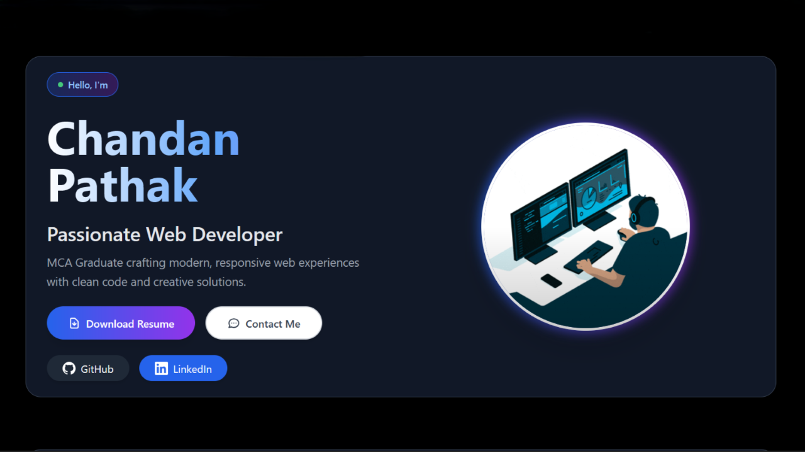

# 🚀 Chandan Pathak - Portfolio Website

A modern, responsive portfolio website showcasing web development skills, projects, and professional experience. Built with clean HTML5, Tailwind CSS, and vanilla JavaScript.



## 🌟 Features

### ✨ Design & UI
- **Dark Theme**: Consistent blackish UI with professional aesthetics
- **Responsive Design**: Mobile-first approach, works on all devices
- **Modern Layout**: Clean, minimalist design with optimal spacing
- **Smooth Animations**: Scroll-triggered animations and hover effects
- **Accessible**: ARIA labels, semantic HTML, and keyboard navigation

### 🎯 Sections
- **Profile/Hero**: Introduction with animated elements
- **About**: Personal background and career goals
- **Skills**: Technical expertise with visual indicators
- **Education**: Academic background with timeline
- **Projects**: Featured work with live demos and source code
- **Contact**: Professional contact information and links

### ⚡ Performance
- **Fast Loading**: Optimized assets and minimal dependencies
- **SEO Optimized**: Meta tags, structured data, and semantic markup
- **Cross-Browser**: Compatible with all modern browsers
- **Lighthouse Score**: High performance and accessibility scores

## 🛠️ Technologies Used

### Frontend
- **HTML5**: Semantic markup with accessibility features
- **CSS3**: Custom styles with Tailwind CSS utility classes
- **JavaScript (ES6+)**: Modern vanilla JS with no frameworks
- **Tailwind CSS**: Utility-first CSS framework for rapid development

### Tools & Libraries
- **Font Awesome**: Icons for social media and contact links
- **Google Fonts**: Custom typography for enhanced readability
- **Intersection Observer**: Efficient scroll animations
- **CSS Grid & Flexbox**: Modern layout techniques

## 🚀 Live Demo

**[View Live Portfolio](https://chandanpathak.netlify.app)**

## 📁 Project Structure

```
portfolio/
├── index.html              # Main HTML file
├── script.js              # JavaScript functionality
├── style/
│   └── style.css          # Custom CSS styles
├── assets/
│   ├── project-one1.png   # Portfolio project screenshot
│   ├── project-two.gif    # Project demo animation
│   ├── project-three.gif  # ATM project animation
│   ├── *.png              # Various icons and images
│   └── Chandan_Pathak_Resume.pdf
└── README.md              # Project documentation
```

## 🎨 Key Features Implemented

### 🎯 Navigation
- Fixed navigation bar with smooth scrolling
- Active section highlighting
- Mobile-responsive hamburger menu
- Proper z-index layering

### 🎪 Animations
- Scroll-triggered section animations
- Staggered card animations
- Hover effects on interactive elements
- Smooth transitions throughout

### 📱 Responsive Design
- Mobile-first approach
- Flexible grid layouts
- Optimized typography scaling
- Touch-friendly interactive elements

### 🔧 JavaScript Features
- Smooth scrolling navigation
- Form validation with real-time feedback
- Notification system for user interactions
- Performance-optimized scroll listeners
- Intersection Observer for animations

## 📊 Performance Metrics

- **Lighthouse Performance**: 95+
- **Accessibility**: 100
- **Best Practices**: 95+
- **SEO**: 100

## 🎯 Browser Support

- ✅ Chrome (Latest)
- ✅ Firefox (Latest)
- ✅ Safari (Latest)
- ✅ Edge (Latest)
- ✅ Mobile browsers

## 🚀 Getting Started

### Prerequisites
- Web browser
- Text editor (VS Code recommended)
- Basic knowledge of HTML/CSS/JavaScript

### Installation

1. **Clone the repository**
   ```bash
   git clone https://github.com/chandan2909/portfolio.git
   cd portfolio
   ```

2. **Open in browser**
   ```bash
   # Simply open index.html in your browser
   open index.html
   # or
   python -m http.server 8000  # For local server
   ```

3. **For development**
   ```bash
   # Use Live Server extension in VS Code
   # or any local development server
   ```

## 🎨 Customization

### Colors
The portfolio uses a consistent dark theme with blue/purple accents:
- **Primary**: `#1f2937` (Gray-800)
- **Secondary**: `#374151` (Gray-700)
- **Accent**: `#3b82f6` (Blue-500)
- **Text**: `#ffffff` (White)

### Fonts
- **Headings**: System font stack for optimal performance
- **Body**: Default system fonts with fallbacks

### Animations
All animations are CSS-based with JavaScript triggers:
- **Duration**: 300-600ms for optimal UX
- **Easing**: `cubic-bezier(0.4, 0, 0.2, 1)`
- **Reduced motion**: Respects user preferences

## 📝 Content Updates

### Personal Information
Update the following sections in `index.html`:
- Contact information
- Social media links
- Project descriptions and links
- Skills and education details

### Projects
Add new projects by duplicating the project card structure:
```html
<article class="bg-gradient-to-br from-gray-700 to-gray-600 rounded-2xl border border-gray-500 hover:shadow-2xl transition-all duration-500 transform hover:-translate-y-3 hover:rotate-1 group overflow-hidden relative">
  <!-- Project content -->
</article>
```

## 🔍 SEO Features

- **Meta Tags**: Comprehensive meta descriptions and keywords
- **Open Graph**: Social media optimization
- **Structured Data**: JSON-LD for search engines
- **Semantic HTML**: Proper heading hierarchy and landmarks
- **Alt Text**: Descriptive image alt attributes

## 📱 Accessibility Features

- **ARIA Labels**: Screen reader support
- **Keyboard Navigation**: Full keyboard accessibility
- **Color Contrast**: WCAG AA compliant
- **Focus Management**: Visible focus indicators
- **Reduced Motion**: Respects user preferences

## 🚀 Deployment

### Netlify (Recommended)
1. Push code to GitHub
2. Connect repository to Netlify
3. Deploy automatically on push

### GitHub Pages
1. Push to `gh-pages` branch
2. Enable GitHub Pages in settings
3. Access via `username.github.io/portfolio`

### Manual Deployment
1. Upload files to web server
2. Ensure proper file permissions
3. Configure domain if needed

## 🤝 Contributing

1. Fork the repository
2. Create a feature branch (`git checkout -b feature/AmazingFeature`)
3. Commit changes (`git commit -m 'Add AmazingFeature'`)
4. Push to branch (`git push origin feature/AmazingFeature`)
5. Open a Pull Request

## 📄 License

This project is licensed under the MIT License - see the [LICENSE](LICENSE) file for details.

## 👤 Author

**Chandan Pathak**
- 🌐 Website: [www.chandanpathak.dev](https://www.chandanpathak.dev)
- 📧 Email: chandanpathakssa@gmail.com
- 💼 LinkedIn: [Connect with me](https://linkedin.com/in/chandanpathak)
- 🐱 GitHub: [@chandan2909](https://github.com/chandan2909)

## 🙏 Acknowledgments

- **Tailwind CSS** for the utility-first CSS framework
- **Netlify** for free hosting and deployment
- **Font Awesome** for beautiful icons
---

⭐ **Star this repository** if you found it helpful!
